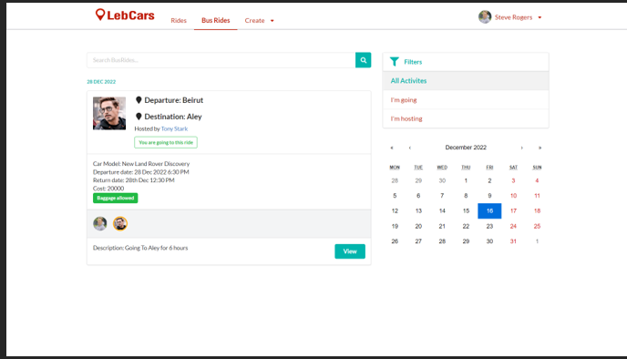
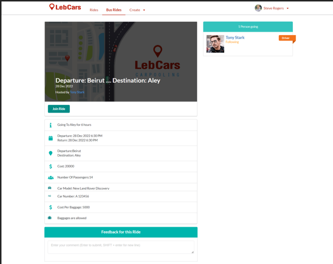
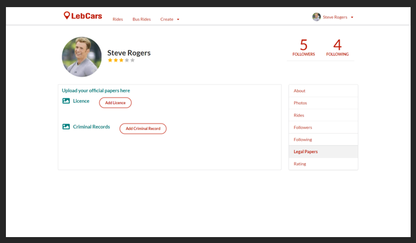
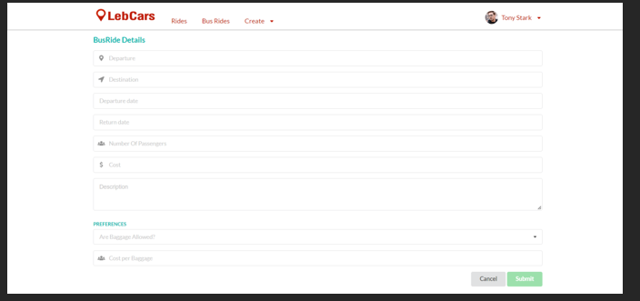

# LebCars Portfolio

## Overview

LebCars is a ride-sharing platform built using ASP.NET Core, React, TypeScript, Entity Framework Core, and SignalR.

This repository showcases my personal contribution to the project.

## My Contribution

I designed and implemented:

* Bus Ride management system
* Bus Ride creation and editing
* Bus Ride attendance management
* Driver verification workflow
* Driver license uploads
* Criminal record uploads
* Ride filtering and searching
* Refresh token authentication
* Database model extensions
* Profile enhancements

## Technologies

Backend:

* ASP.NET Core
* Entity Framework Core
* ASP.NET Identity
* SignalR

Frontend:

* React
* TypeScript
* MobX

Database:

* SQLite

## Key Features

### Bus Ride System

Users can:

* Create Bus Rides
* Join Bus Rides
* Cancel attendance
* Host rides
* Edit rides
* Cancel rides

### Driver Verification

Drivers must upload:

* Driver License
* Criminal Record

before creating rides.

### Authentication

Implemented refresh-token support to improve session management.

## Project Screenshots

## Screenshots

### Bus Ride List

---

### Bus Ride Details

---

### Driver Verification

---

### Create Bus Ride

## Lessons Learned

This project taught me:

* Domain modeling
* Authentication systems
* Entity Framework relationships
* React state management
* Full-stack application architecture
